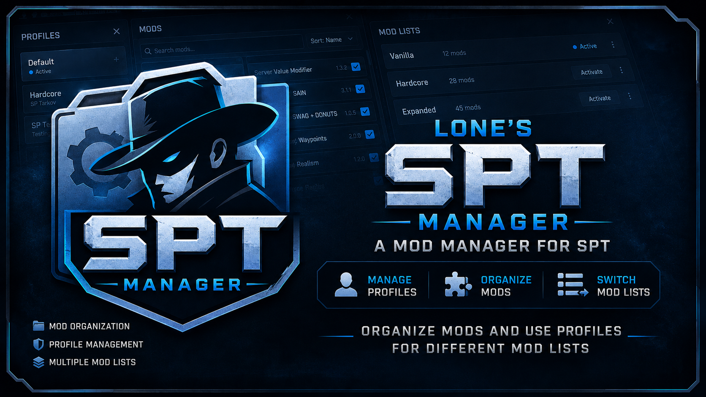

  

# Lone's SPT Manager

A Windows manager for **SPT 4.1**. Mods stay **outside** the game folder. Each **profile** keeps its own enabled mods, load order, saves, configs, and leftover files. [The Forge](https://sp-mod.com/) is built in for search and install.

Download the exe from [GitHub Releases](https://github.com/Loneranger419/lones-spt-manager/releases). This app is not listed on The Forge.

Use it if you want to:

- Keep a clean SPT install and swap setups without copying folders by hand
- Run more than one profile (solo vs Fika, different packs, a test character)
- Install from The Forge or from a shared `mods.json` pack
- Launch **solo**, **Fika host**, or **Fika join** from one window

This is **not** [SPT Mod Manager](https://sp-mod.com/mod/2851/spt-mod-manager). Do not run both against the same install. This app will not download SPT Mod Manager from The Forge.

Not affiliated with SPT, SP-Tushonka, Battlestate Games, or Mod Organizer 2. [MIT](LICENSE) licensed.

AI coding tools wrote a large part of this app. That is why it is not on The Forge ([their AI policy](https://sp-mod.com/content-guidelines)). Read the source if you care how it works before you point it at your SPT install.

  

---

## Install

1. Install a working **SPT 4.1.2** copy first (the folder with `EscapeFromTarkov.exe`, `BepInEx`, and `SPT_Runtime`).
2. Download the latest **zip** from [GitHub Releases](https://github.com/Loneranger419/lones-spt-manager/releases).
3. Extract it somewhere **that is not** your SPT game folder. Put `LonesSptManager.exe` on the desktop or in its own folder.
4. Run `LonesSptManager.exe`. No extra .NET install is required.
5. If Windows says **Windows protected your PC**, that is common for an unsigned exe. Use **More info → Run anyway** only if you trust the download.
6. **Bind** the SPT game root (the same folder as `EscapeFromTarkov.exe`). Manager data defaults to `%AppData%\LonesSptManager`.
7. Add a **profile** (or keep the first one) and start installing mods.

`mods.json.example` in the zip is a sample pack file. You do not need it unless you are building or sharing a pack.

### Remove it

1. In the app, **Settings → Purge manager data** if you want the junctions and cached mods gone. That does **not** delete your SPT install.
2. Close the app and delete `LonesSptManager.exe` (and the folder you extracted).
3. Optional: delete `%AppData%\LonesSptManager`.

After a purge, **Bind** again if you still want to use the manager.

---

## How to use

### Daily loop

1. Pick a **profile** at the top. Switching deploys that profile onto the game.
2. Enable or disable mods on the left list. Drag to change **load order** (0 at the top loads first; later rows win when files overlap).
3. **Deploy** if you changed mods and are not about to Launch (Launch deploys first).
4. **Launch**. The window stays busy until that session’s server and/or client have quit.
5. **Harvest** after you quit so new configs and leftover files come back into the profile.

The window blurs with a spinner during profile switch, Deploy, Harvest, and Launch. Wait it out.

### Install mods

- **The Forge** tab — search, select, **Install**. **Updates** checks what you already have.
- **Import zip** — drop in a `.zip` / `.7z` you already downloaded.
- **Add profile → Install from pack** — HTTPS link or a local `mods.json`. List order is load order (0 first). Each entry needs a Forge `id` and `installedVersion`. Failed mods are skipped. Edit the profile later and **Update** to reinstall that pack.

A pack can copy from another profile **or** install from JSON, not both in one go.

### Profiles

**Add** can start empty, copy from another profile (saves, generated files, BepInEx configs, Overwrite, enabled mods), or install a pack.

**Edit** can rename, copy, delete (not the last profile), or **Update** a saved pack link.

The last profile you used is selected again next time.

### Overwrite

After Harvest, extra files land on the **Overwrite** tab. Configs that belong to a mod are attached to that mod for this profile — including F12 BepInEx `.cfg` files matched by plugin folder or DLL name when the Forge GUID is missing. Greyer rows are generated/state files that stay in Overwrite. You can **Assign to mod**, **Discard file**, or **Discard all Overwrite**.

### Already-modded install

If SPT already has real folders in `BepInEx\plugins` or `SPT_Runtime\user\mods`, right-click a leftover row → **Import leftover into store**, then Deploy so the manager owns it.

### Other buttons

- **Settings** — theme (follow Windows, Dark, or Light), manager data folder, and **Purge manager data**.
- **Repair** — fix a stuck or half-applied deploy.

---

## Fika

Install the Fika **client** and **server** mods on the profile the same way as any other Forge mods. Everyone in the group needs the Fika client plugin.

| Mode | What it starts | When to use |
| --- | --- | --- |
| `solo` | SPT server, then the SPT launcher | Normal single-player |
| `fika-host` | SPT server, then the SPT launcher | You are hosting |
| `fika-client` | SPT launcher only | You are joining someone else |

For **fika-client**, put the host URL in **Join URL** (example: `https://their-pc:6969`). The manager writes that into the launcher config and leaves the other keys alone.

This app never starts `EscapeFromTarkov.exe` or BattlEye. You click Play in the SPT launcher like usual.

---

## FAQ

**Do I extract this into the SPT folder?**
No. Keep the exe outside the game. Bind the game root from inside the app.

**Can I use this with [SPT Mod Manager](https://sp-mod.com/mod/2851/spt-mod-manager)?**
No. Pick one manager for an install.

**Where did my F12 / mod settings go?**
Quit the game, then **Harvest**. Settings that belong to a mod stay with that mod on this profile.

**I changed mods but the game looks the same.**
**Deploy** (or Launch, which deploys first). Make sure the checkboxes on the left are what you want. An empty enabled list means everything is off.

**A Forge / pack install failed.**
Read the Log tab. Other mods still install. Try again, or install that one from **The Forge** tab.

**Windows blocked the exe.**
Unsigned indie builds often trip SmartScreen. Use **More info → Run anyway** only if you got the file from the GitHub Release.

**Does Purge delete Tarkov / SPT?**
No. It only removes this manager’s data. Bind again afterward.

**Linux / Steam Deck?**
Windows only.

**How do I switch dark mode?**
**Settings** (top right). Theme can follow Windows, or stay Dark / Light. The manager data folder and **Purge manager data** are in the same window. Unchecked mods in the list are greyed out.

---

Build from source and internals: [`docs/DEVELOPERS.md`](docs/DEVELOPERS.md).
